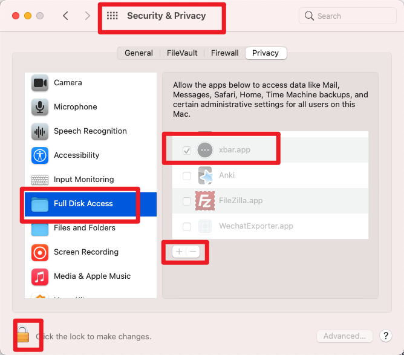

# xbar-plugins


## 读取短信验证码并注入剪贴板 sms\_code.py

- 读取iMessage中的短信验证码。并将验证码注入剪贴板，Command + V 即可使用。
- 有多条情况下，最后一条在剪贴板中。可通过xbar menu查看多条验证码
- 点击xbar menu中短信既拷贝验证码到剪贴板
- 增加webhook，上传短信内容到云端。
- 保留最后10条短信，不会重复注入剪贴板，除非有新的验证码短信
- 新短信验证码通过MacOS Notification通知


### 注意
**需赋予 xbar Full Disk Access 权限**。



## FAQ

### Q: 如果脚本运行时间超过设置的插件refresh事件，会不会出现插件（脚本）被运行多次的问题？
A：不会，根据测试，xbar的refresh实质是当前插件执行完成后下一次运行的间隔。

```
# 配置refresh 为 1s
import datetime
import time

now = datetime.datetime.now()
s = now.strftime("%Y-%m-%d %H:%M:%S")
s += " => "

time.sleep(5)

after = datetime.datetime.now()
s += after.strftime("%Y-%m-%d %H:%M:%S")

print(s)
```
